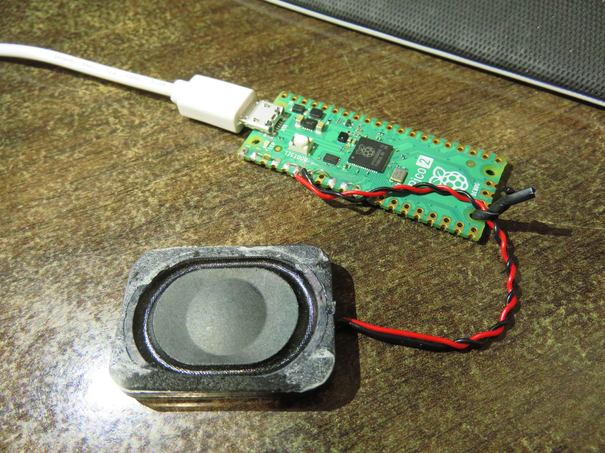
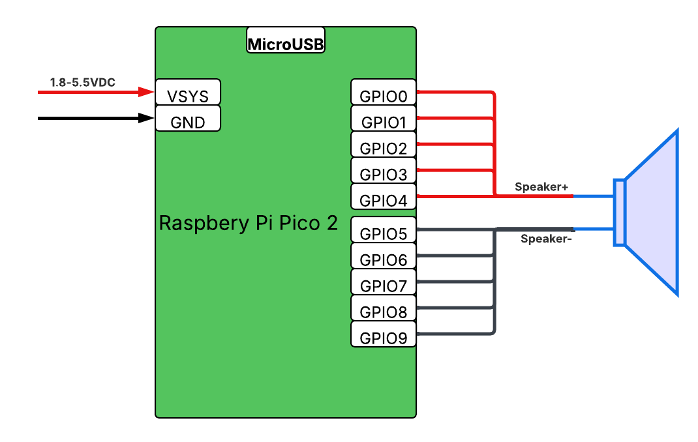
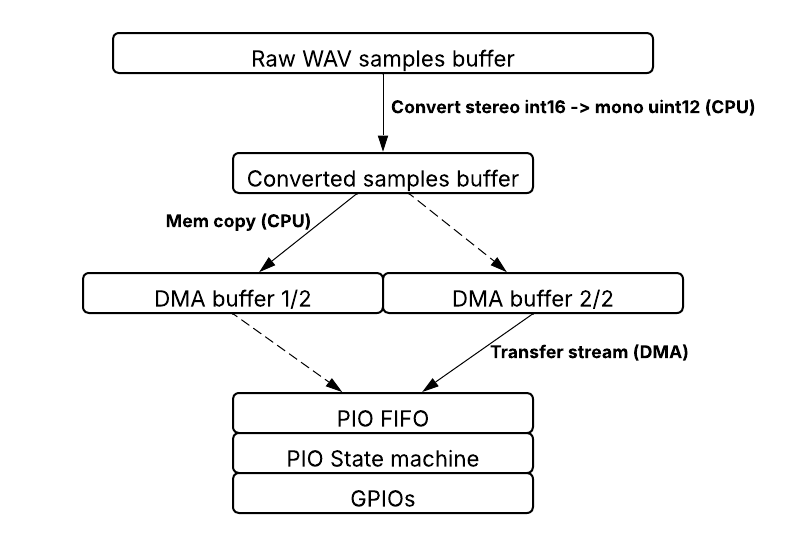

# Picowave - a Raspberry Pi Pico 2 WAV Player

This is an MicroPython educational project meant to learn about the PIO and DMA features of the RP2350, and to experiance the nuts and bolts of driving an audio signal.  

The result is an acceptable quality WAV player that can play files from flash memory at a sample rate of 18.295kHz. The playback is mono, since only differential speaker drive is used, but can be easily extended to stereo by doubling the number of PIOs and DMA channels used. Audio bit depth is 12 bits (but files are the standard 16 bits).  

The available flash memory is the limited 4MiB of the Pico 2, however this solution can be easily adapted to interface an SD card, which would allow up to 32GB of storage.  

## How to Use
### Hardware Requirements
You would need:
- A Raspberry Pi Pico 2 (RP2350) board
- A small speaker or headphones (8 Ohm or higher impedance), [like the 8 Ohm version here](https://www.aliexpress.com/item/1005005699882165.html).
- Wiring each of the speaker leads to 1-5 contiguous GPIO pins on the Pico 2, as described in the wiring diagram below.  

### Wiring Diagram
5 GPIO pins are used in parallel to drive each speaker lead, to provide enough current. They are arranged in two groups of 5 contiguously numbered GPIO pins, driven in a complementary manner to produce a differential drive.  



### MicroPython
To use this project, you will need to install MicroPython on your Raspberry Pi Pico 2. You can find instructions on how to do this on the [official MicroPython website](https://www.raspberrypi.com/documentation/microcontrollers/micropython.html).  
It is recommended to use [Thonny](https://thonny.org/) as the IDE, since it has built-in support for MicroPython and makes it easy to upload files.

### Uploading Files
Once you have MicroPython installed, you can upload the files in this project to your Pico 2. You can do this using Thonny's file manager or by using ampy, rshell, mpremote, or any other tool that allows you to upload files to the Pico 2.  
You would want to upload the `main.py` and `pio.py` source code files, as well as one or more WAV files. You can use the provided `sweet_child_mono_16b_18k295_long.wav` file which is already in the correct format (see the section below on File Format and Handling).

### Running the Player
Once the files are uploaded, you can run the player by executing the `main.py` script, which should also be run automatically when the Pico 2 boots up. Alternatively, you can import and use the *DMAWavPlayer* class in your own scripts.  

The Pico 2 will heat up a bit while playing audio, which is normal. The rise in temperature is caused by the IR drop of the current flowing through the GPIO pins, and should be in the range of 10-15 degrees Celsius for a speaker with 8 Ohm impedance.

[Watch a Video](./files/images/video.mp4).


## Theory of Operation
An audio signal is an voltage or current, oscillating at audio frequencies of 20-20kHz, that is used to feed audio to an amplifier, or to directly drive a coil (in a speaker, or headphones) to produce sound.  

Coils are inductive, which means that they "smooth" very fast current transients. This means that an audio signal can be generated by very fast switching of a current source, reacting with the inductance to form a continuous signal, as long as the switching is modulated just right to produce sound. This is how [class D amplifiers](https://en.wikipedia.org/wiki/Class-D_amplifier)
work, and this is the principle used in this project.  

Every microprocessor (MCU) has GPIO (General Purpose Input/Output) pins, which can be used to control external devices. These can be used as a fast switching current source. If the MCU can switch the GPIO pins fast enough and in a precisely timed manner, it can then drive a speaker to play digital audio samples, taken from a WAV file.  

A description of a similar solution can be found in [this application note](https://www.nxp.com/docs/en/application-note/AN4369.pdf).

## The PIO State Machine
TODO

## The DMA and Buffer System



## File Format and Handling
WAV files are a standard audio file format which is typically formatted as a header, followed by a series of binary samples. The samples can be re-sampled to different sample rates and with different bit depths by using a tool like [ffmpeg](https://www.ffmpeg.org/download.html).
   
Our player runs at a fixed sample rate of 18.295kHz, which is a good compromise between audio quality and the limitations of the RP2350's PIO and DMA capabilities. The WAV files are expected to be sampled in this sample rate, and in 16-bit format (support is for either mono or stereo, in which case the second channel is ignored).  

A typical conversion command using ffmpeg would be:

```bash
ffmpeg -i .\sweet_child.mp3 -t 80 -ar 18295 -sample_fmt s16 -ac 1 -af "afade=out:st=76:d=4" sweet_child_mono_16b_18k295_long.wav
```